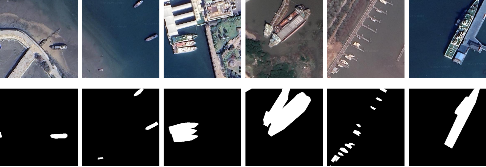
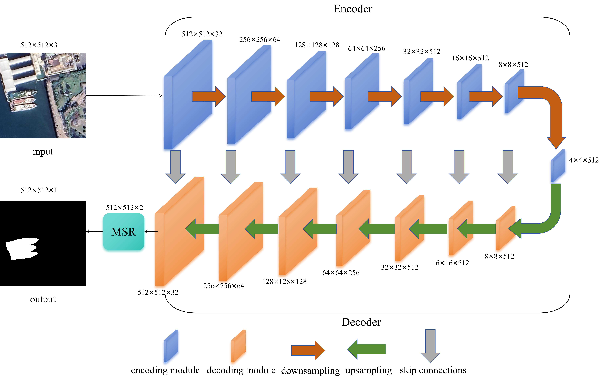
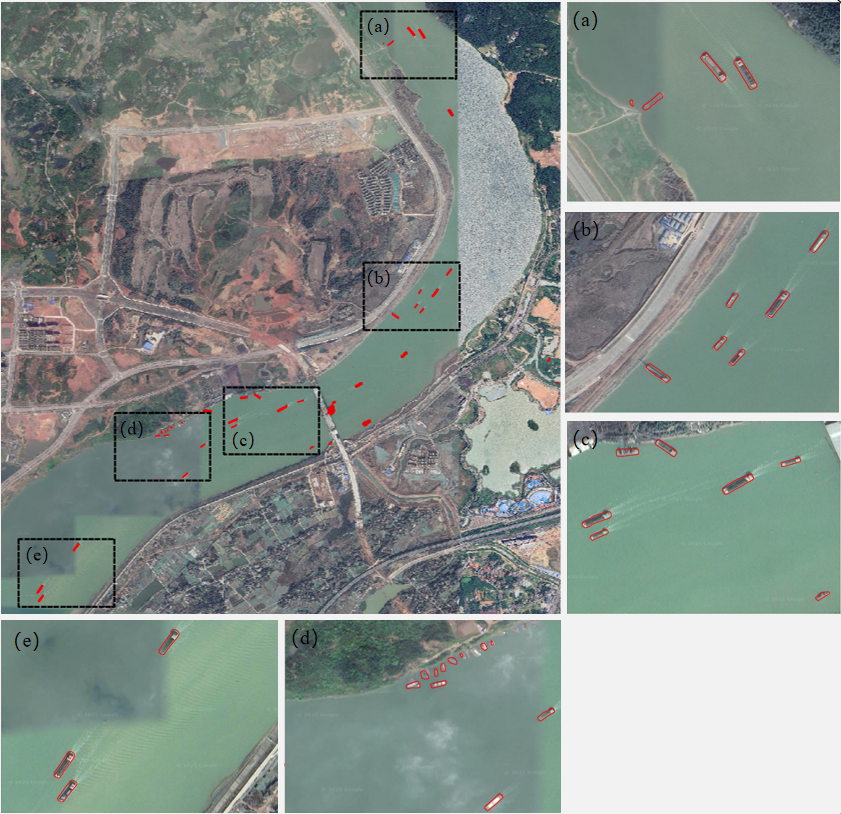

## SSegCADFNet: A Novel Lightweight Convolutional-Attention Network for Remote Sensing Ship Segmentation


### Datasets
- The complete ship segmentation dataset can be obtained from Baidu Cloud:
  https://pan.baidu.com/s/1AaNwXSyB9PZaZnp7Nba_8g 
  Extraction code：erej

- Some examples of the dataset are as follows:
  
  
### module structure
- the module structure of SSegCADFNet is as follow:
  

- Module file
```python
module\SSegCADFNet.py:   the main model file of SSegCADFNet.
```

### performance

- The performance of SSegCADFNet in real-world can be seen as follows:


### Usage
- Before running SSegCADFNet, several third-party libraries should be installed:
```python
torch
torchvision
xformers
numpy
scikit-image
```
- To test SSegCADFNet, just use following script:
```python
python test.py
```

<!-- - The image with adverse image conditions through the SSegCADFNet can be seen as follows:
 -->

<!-- ### reference
```python
Author:  Wang Z, Wang Z, Tang X, Zhang Q, et al. 
Title:   Robust Remote Sensing Change Detection in Adverse Conditions with An Image-Adaptive Method. 
Journal: TGRS 2024. 
Date:    2024
``` -->