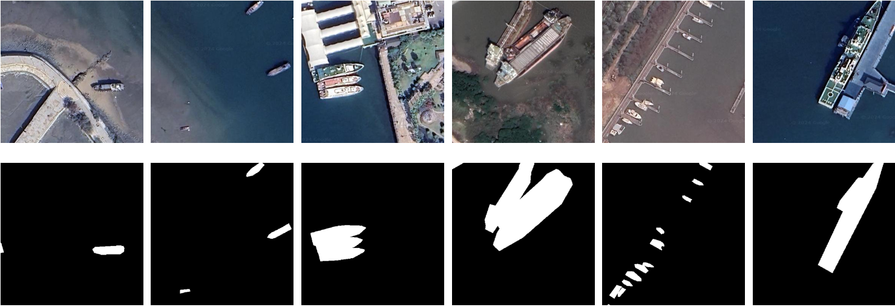
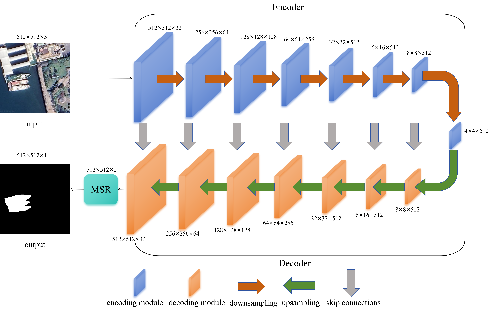
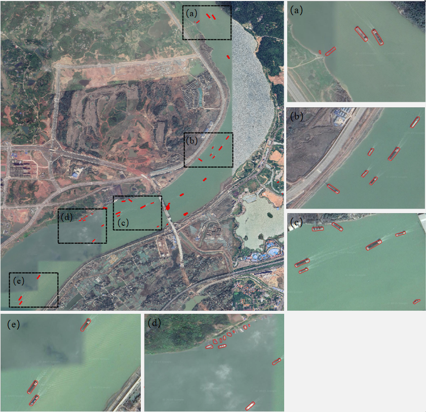

## SSegCADFNet: A Novel Lightweight Convolutional-Attention Network for Remote Sensing Ship Segmentation


### Datasets
- The complete ship segmentation dataset can be obtained from Baidu Cloud:
  https://pan.baidu.com/s/1AaNwXSyB9PZaZnp7Nba_8g 
  Extraction code：erej

- Some examples of the dataset are as follows:
  
  
### module structure
- the module structure of SSegCADFNet is as follow:
  

- Module file
```python
module\ShipSegNet.py:   the main model file of ShipMS-BSNet.
```

### performance

- The performance of ShipMS-BSNet in real-world can be seen as follows:


### Usage
- Before running ShipMS-BSNet, several third-party libraries should be installed:
```python
torch
numpy
scikit-image
```
- To train ShipMS-BSNet, just use following script:
```python
python main.py
```

